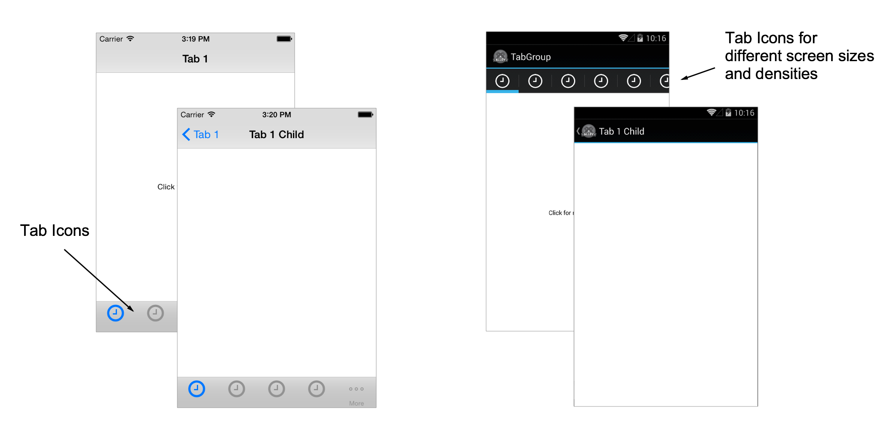

# Template.Tab-based-App

Use this Alloy Barebones App Template if the app you're building requires tab-based navigation.  This template an example of how to achieve two levels of navigation.  Additionaly, the template includes examples of how to handle tab images for multiple iOS and Android screen sizes and densities (look at the /assets/iphone/images and /assets/android/images folders).

# License

This code is licensed under the Apache Public License (Version 2).